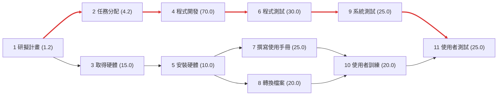
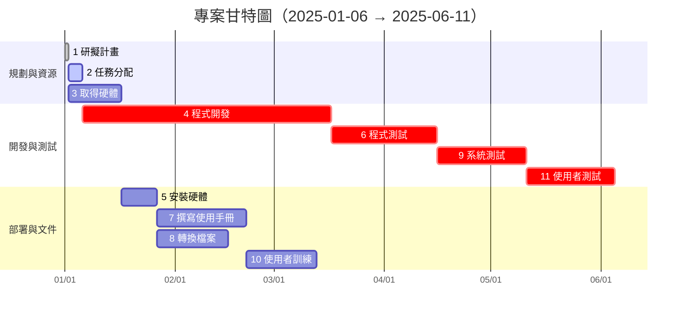

# 圖3-27 工作分解結構清單
---

## 任務清單與任務模式

| 編號 | 任務名稱 | 前置任務 | 樂觀時間 (B) | 最可能時間 (P) | 悲觀時間 (W) | 期望時間 te = (B+4P+W)/6 | 
|------|-----------|-----------|---------------|----------------|---------------|--------------------------|
| 1 | 研擬計畫 | - | 1 | 1 | 2 | 1.2 | 
| 2 | 任務分配 | 1 | 2 | 4 | 6 | 4.2 |
| 3 | 取得硬體 | 1 | 10 | 15 | 20 | 17 | 
| 4 | 程式開發 | 2 | 50 | 70 | 90 | 70 | 
| 5 | 安裝硬體 | 3 | 5 | 10 | 15 | 10.2 |
| 6 | 程式測試 | 4 | 20 | 30 | 40 | 30 | 
| 7 | 撰寫使用手冊 | 5 | 20 | 25 | 30 | 25 | 
| 8 | 轉換檔案 | 5 | 15 | 20 | 25 | 20 | 
| 9 | 系統測試 | 6 | 20 | 25 | 30 | 25 | 
| 10 | 使用者訓練 | 7,8 | 15 | 20 | 25 | 20 |
| 11 | 使用者測試 | 9,10 | 20 | 25 | 30 | 25 | 
---

## 1) PERT/CPM 網路圖

---

## 2) 甘特圖

---

## 3) 關鍵路徑

- `1 → 2 → 4 → 6 → 9 → 11`  
